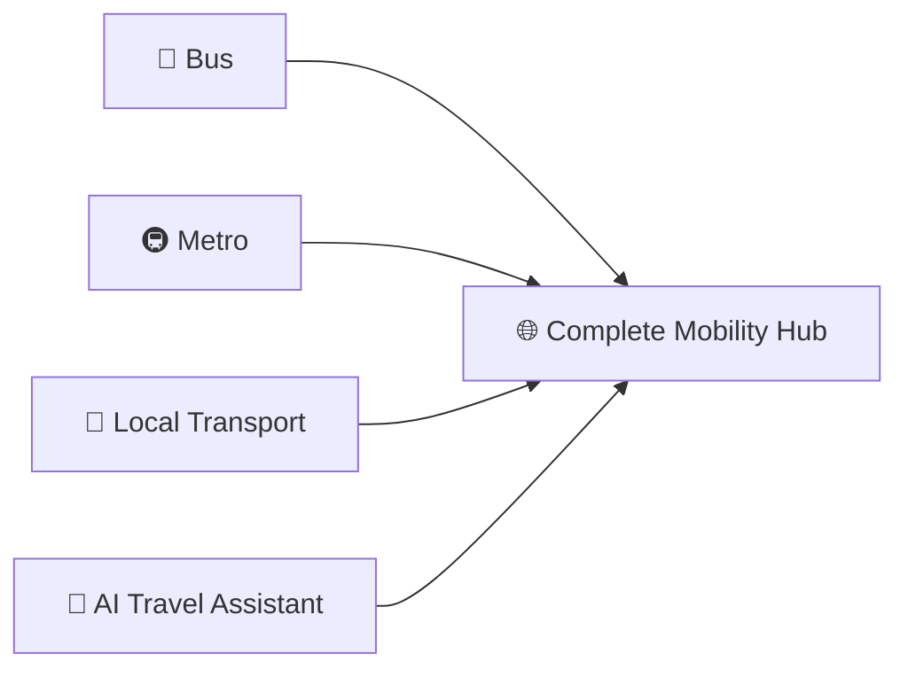

# GoBus 🚍  
**Smart Bus Booking & Mobility Platform**

<p align="center">
  
  
  
  
</p>

<p align="center">
  
  
  
  
  
  
  
  
</p>

---

## 📱 **Overview**

**GoBus** is a smart bus booking and mobility platform designed to simplify travel through seamless ticket booking, real-time tracking, digital ticket management, and integrated transportation services. Travelers can search, compare, and book bus tickets with ease while enjoying a smooth and reliable travel experience. The platform aims to evolve beyond traditional bus booking by integrating multiple transportation services into a single ecosystem.

---

## ✨ **Features**

### 🚌 **Bus Ticket Booking**
- Search buses by source and destination
- View available schedules
- Select preferred seats
- Secure online payments
- Instant booking confirmation

### 🎫 **Digital Tickets**
- Paperless ticket management
- QR-based boarding
- Download and share tickets

### 📍 **Live Tracking**
- Real-time bus location tracking
- Estimated arrival times
- Journey status updates

### 🔔 **Smart Notifications**
- Boarding reminders
- Departure alerts
- Booking and cancellation updates

### 💳 **Multiple Payment Methods**
- UPI
- Debit/Credit Cards
- Net Banking
- Digital Wallets

### ⭐ **Reviews & Ratings**
- Passenger feedback system
- Service quality insights

---

## 🎯 **Problem Statement**

Travelers often face:
- ❌ Complicated booking processes
- ❌ Multiple apps for different transport services
- ❌ Limited real-time travel information
- ❌ Difficulty managing tickets and schedules

**GoBus** addresses these challenges by providing a centralized and user-friendly travel platform.

---

## 👥 **Target Users**

<table>
  <tr>
    <td align="center"><br /><b>Students</b><br />Affordable travel<br />Easy daily commuting</td>
    <td align="center"><br /><b>Professionals</b><br />Quick booking<br />Reliable schedules</td>
    <td align="center"><br /><b>Families</b><br />Group bookings<br />Comfortable travel</td>
    <td align="center"><br /><b>Tourists</b><br />Route discovery<br />Hassle-free reservations</td>
  </tr>
</table>

---

## 🚀 **Future Roadmap**

| Feature | Status | Description |
|---------|--------|-------------|
| 🚇 Metro Integration | 🔜 Planned | Plan journeys across buses and metro services |
| 🤖 AI Travel Assistant | 🔜 Planned | Route recommendations, delay predictions, personalized suggestions |
| 🎓 Student Benefits | 🔜 Planned | Discount programs, campus transportation support |
| 📦 Parcel Delivery | 🔜 Planned | Send and track parcels through partner bus networks |
| 🏨 Travel Ecosystem | 🔜 Planned | Hotel booking, local transport integration, travel packages |

---

## 🏆 **Unique Selling Point**

> **GoBus is not just a bus booking app.**

It aims to become a **complete mobility hub**, connecting:



**within a single platform.**

---

## 🛠️ **Tech Stack**

<details>
<summary><b>Click to expand</b></summary>

### Frontend
- ⚛️ React (Planned)
- 🎨 HTML5 & CSS3
- ⚡ JavaScript (ES6+)

### Backend
- 🖥️ Node.js / Spring Boot
- 🔄 RESTful APIs

### Database
- 🗄️ MySQL / PostgreSQL
- 🔐 Secure data management

### APIs
- 🗺️ Maps API
- 💳 Payment Gateway API
- 🚌 Bus Tracking API

</details>

---

## 📱 **Vision**

> *To create India's most accessible and intelligent transportation platform that makes travel simple, connected, and efficient for everyone.*

---

## 🚀 **Getting Started**

```bash
# Clone the repository
git clone https://github.com/yourusername/gobus.git

# Navigate to project directory
cd gobus

# Install dependencies
npm install

# Start development server
npm start
```

---

## 🤝 **Contributing**

We welcome contributions! Please see our [Contributing Guidelines](CONTRIBUTING.md).

1. Fork the repository
2. Create your feature branch (`git checkout -b feature/AmazingFeature`)
3. Commit your changes (`git commit -m 'Add some AmazingFeature'`)
4. Push to the branch (`git push origin feature/AmazingFeature`)
5. Open a Pull Request

---

## 📄 **License**

This project is licensed under the MIT License - see the [LICENSE](LICENSE) file for details.

---

## 📞 **Contact**

<p align="center">
  <a href="#"></a>
  <a href="#"></a>
  <a href="#"></a>
  <a href="#"></a>
</p>

---

<p align="center">Made with ❤️ by the GoBus Team</p>
<p align="center">
  
  
</p>
